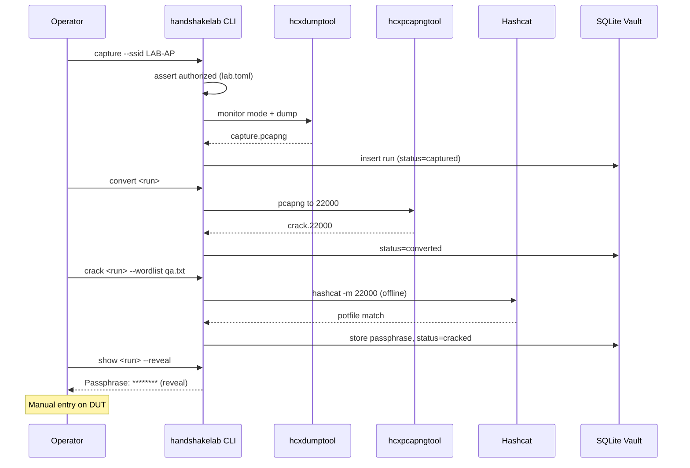

# HandshakeLab — Architecture

## Overview

HandshakeLab is a **local orchestration layer** around mature WiFi security tools. It does not implement cryptographic cracking itself; it manages capture artifacts, authorization policy, and offline crack jobs.

## Layered architecture

```
┌─────────────────────────────────────────────────────────────┐
│ Layer 4: Operator interfaces                                 │
│   CLI (Typer) · optional FastAPI localhost UI (Phase 6)      │
├─────────────────────────────────────────────────────────────┤
│ Layer 3: Domain services                                     │
│   scan · capture · convert · crack · report · vault          │
├─────────────────────────────────────────────────────────────┤
│ Layer 2: External tool adapters                              │
│   hcxdumptool · hcxpcapngtool · hashcat · tshark · iw        │
├─────────────────────────────────────────────────────────────┤
│ Layer 1: OS / hardware                                       │
│   Linux nl80211 · monitor mode driver · USB WiFi adapter     │
└─────────────────────────────────────────────────────────────┘
```

## Module responsibilities

### `cli.py`

- Parses commands and global flags (`--config`, `--verbose`).
- Routes to service modules.
- Enforces that `capture` and `scan` require elevated privileges.

### `legal.py` + `config.py`

- Loads `lab.toml`.
- Validates every capture target against allow-list.
- Refuses operation if `require_authorization=true` and target not listed.

### `doctor.py`

Preflight checks:

| Check | Command / method |
| --- | --- |
| Root available | `os.geteuid() == 0` for capture |
| Adapter exists | `/sys/class/net/{iface}` |
| Monitor mode | `iw phy info` → `* monitor` |
| hcxdumptool | `which hcxdumptool` |
| hcxpcapngtool | `which hcxpcapngtool` |
| hashcat | `hashcat -V` |
| tshark (optional) | validate EAPOL |

### `capture.py`

1. Stop NetworkManager on capture iface (or use `iw dev` only).
2. `ip link set wlan1 down && iw dev wlan1 set type monitor && ip link set wlan1 up`
3. Launch `hcxdumptool` with filter for target BSSID.
4. On timeout, verify capture non-empty.
5. Restore managed mode.

**No crack logic here.** Capture module never calls hashcat.

### `convert.py`

- Input: `capture.pcapng`
- Output: `crack.22000`
- Validates hash count > 0 before marking run `converted`.

### `crack.py`

- Builds hashcat command: `hashcat -m 22000 -w {profile} -o potfile ...`
- Parses potfile / `--show` for recovered passphrase.
- Records wall time and wordlist path in SQLite.

**Offline only:** no subprocess calls to `wpa_supplicant`, `nmcli device wifi connect`, etc.

### `vault.py`

- Assigns ULID/UUID per run.
- Directory layout under `$XDG_DATA_HOME/handshakelab/captures/`.
- SQLite index for search and reporting.

### `report.py`

Generates:

```markdown
# HandshakeLab QA Report
- Run ID: 01J...
- SSID: LAB-AP-01
- BSSID: AA:BB:CC:DD:EE:FF
- Captured: 2026-06-14T10:30:00Z
- Crack method: hashcat:22000:qa-wordlist.txt
- Crack duration: 42s
- Result: SUCCESS (password strength: weak)
- Operator: ufonik
- Authorization: QA-2026-014
```

## Sequence: happy path



## Privilege model

| Action | Privilege |
| --- | --- |
| doctor, convert, crack, show, report | user |
| scan, capture | root (CAP_NET_ADMIN) |

Use `sudo handshakelab capture ...` rather than setuid binary.

## Failure modes

- **Empty capture:** retry with longer duration; confirm client association.
- **Wrong channel:** scan first; pass `--channel` explicitly.
- **Hashcat exit 1:** exhausted wordlist — not a crash; report `failed`.
- **Driver crash:** document adapter reset procedure in HARDWARE.md.

## Extension points

- `CaptureBackend` protocol — swap hcxdumptool for airodump-ng.
- `CrackBackend` protocol — add John the Ripper.
- `StorageBackend` — future encrypted remote vault (not v1).