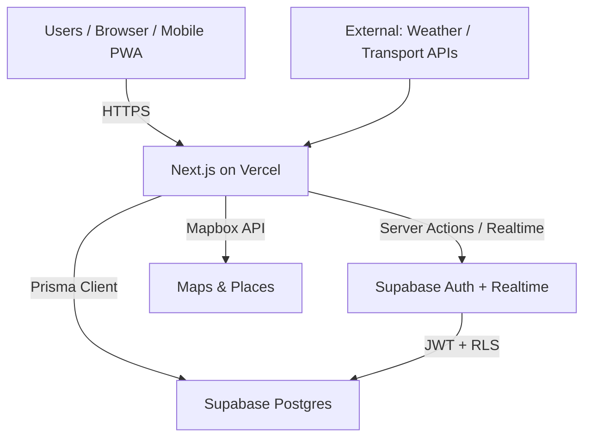

# WeHopOn Technical Blueprint

**Project:** WeHopOn (Collaborative Hop-On/Hop-Off Travel Planner)
**Date:** 2026-06-14
**Status:** Phase 1 Skeleton Complete (verification in progress)
**Approach:** Web-first MVP with Next.js 16 + Tailwind 4 + Supabase + Prisma. Ready-to-fill template for the specific concept.

---

## 1. Discovery & Research Phase

### Feasibility Analysis
To evaluate core technical challenges, APIs, and third-party integrations for a modern app like WeHopOn:

- **Core Challenges:**
  - Real-time collaboration (location sharing, itinerary updates) → WebSockets or Supabase Realtime.
  - User authentication & authorization (multi-tenant trips, invites) → Supabase Auth (OAuth + email), JWT, RLS policies.
  - Geolocation & maps (stops, routes) → Google Maps / Mapbox API or Leaflet + OpenStreetMap (free tier).
  - Offline support & sync for travel scenarios → Service workers, IndexedDB, eventual consistency with Supabase.
  - Scalability for group features (notifications, payments if added) → Vercel Edge + Supabase Postgres (connection pooling).
  - Data privacy (travel plans, locations) → GDPR compliance, Supabase RLS, encrypted at rest.

- **APIs & Integrations Needed:**
  - Auth: Supabase (Google, Apple, email/magic link).
  - Maps: Mapbox or Google Places for autocomplete/search.
  - Notifications: Supabase Edge Functions + Resend or Twilio.
  - Payments (future): Stripe (if monetization via premium groups).
  - External data: Weather APIs (OpenWeather), public transport (if hop-on/hop-off specific).

- **Risks & Mitigations:**
  - API rate limits/costs: Start with free tiers (Supabase, Mapbox free), add caching (Vercel KV or Redis).
  - Real-time latency: Supabase Realtime is sufficient for MVP; fallback to polling.
  - Multi-device sync: Prisma + Supabase handles it; test with conflict resolution (last-write-wins or CRDT for complex cases).
  - Feasibility score: High (all components have mature, free/cheap SDKs in 2026). Timeline for MVP: 2-4 weeks with 1-2 developers.

Validate by spiking key integrations (e.g., Supabase Realtime + Mapbox in a throwaway branch) before full commit.

### Target Tech Stack

**Web-first Approach (Recommended for MVP):**
- **Frontend:** Next.js 16 (App Router) + TypeScript + Tailwind CSS 4 + shadcn/ui (or Radix primitives) + TanStack Query + React Hook Form + Zod.
- **Backend:** Next.js API routes / Server Actions + Supabase (Auth + Realtime + Storage) + Prisma ORM (for type-safe queries/migrations).
- **Database:** Supabase Postgres (with connection pooling for serverless) + Prisma.
- **Hosting/Cloud:** Vercel (frontend + Edge Functions) + Supabase (DB/Auth) + Mapbox (maps). CI: GitHub Actions. Monitoring: Vercel Analytics + Sentry.
- **Pros:** Fast iteration, excellent DX (TypeScript end-to-end, server components reduce client JS), built-in SSR/SEO, seamless Supabase integration, cheap/free tiers, auto-scaling.
- **Cons:** Serverless cold starts (mitigate with edge), vendor lock-in to Vercel/Supabase (but portable via Prisma).

**Mobile-first Approach (Future/Alternative):**
- **Frontend:** React Native (Expo) or Flutter + TypeScript + Tailwind (via NativeWind) + React Query.
- **Backend:** Same as web (Supabase + Prisma exposed via tRPC or REST).
- **Database:** Same Supabase Postgres.
- **Hosting/Cloud:** Expo EAS / Vercel for web, Supabase, Mapbox.
- **Pros:** Single codebase for iOS/Android/web (with React Native Web), native feel, offline-first easier with libraries like WatermelonDB.
- **Cons:** Slower initial dev (native quirks, debugging), larger bundle, more complex auth (deep links), higher maintenance for platform-specific bugs. Cost: Expo free tier limited for production builds.

**Recommendation:** Start web-first (Next.js) for rapid validation of core loops (create/join trip, add stops, share). Mobile PWA or separate RN app in Phase 2. This matches the executed skeleton in `/home/ufonik/wehopon`.

---

## 2. System Architecture & Integration ("Wiring it Together")

### Data Flow & API Design
Frontend (Next.js client) communicates with backend via:
- **Server Actions / Route Handlers** (for mutations, prefer over REST for simplicity in Next.js).
- **Supabase Realtime** (for live updates: new stops, member joins, location pings).
- **tRPC** (optional for typed RPC if complexity grows; current skeleton uses direct Supabase client + Prisma).
- Fallback: Standard REST if needed for external consumers.

**Key API Endpoints (Template - customize per concept):**

```ts
// Example in app/api/trips/route.ts or server actions
POST /api/trips          // Create trip {name, startDate, stops: [...]}
GET  /api/trips/:id      // Get trip details + members + stops
PATCH /api/trips/:id     // Update trip metadata
POST /api/trips/:id/invite // Send invite (email or link)
POST /api/stops          // Add stop {tripId, lat, lng, name, time}
GET  /api/stops?tripId=  // List stops (realtime subscribed)
POST /api/locations      // Update user location ping (for live map)
```

Authentication: Supabase session (JWT in cookies or headers). Authorization via RLS policies on tables.

### Database Schema
(Prisma schema from current skeleton – ready for extension.)

```prisma
// prisma/schema.prisma (Prisma 7 compatible)
model User {
  id            String    @id @default(cuid())
  email         String    @unique
  name          String?
  avatarUrl     String?
  memberships   Membership[]
  locationPings LocationPing[]
  createdAt     DateTime  @default(now())
}

model Trip {
  id          String   @id @default(cuid())
  name        String
  description String?
  startDate   DateTime?
  endDate     DateTime?
  ownerId     String
  owner       User     @relation(fields: [ownerId], references: [id])
  stops       Stop[]
  members     Membership[]
  createdAt   DateTime @default(now())
}

model Membership {
  id     String @id @default(cuid())
  userId String
  tripId String
  role   String   @default("member") // owner, member, viewer
  user   User     @relation(fields: [userId], references: [id])
  trip   Trip     @relation(fields: [tripId], references: [id])
  @@unique([userId, tripId])
}

model Stop {
  id          String   @id @default(cuid())
  tripId      String
  trip        Trip     @relation(fields: [tripId], references: [id])
  name        String
  lat         Float
  lng         Float
  scheduledAt DateTime?
  notes       String?
  createdById String
  createdBy   User     @relation(fields: [createdById], references: [id])
  createdAt   DateTime @default(now())
}

model LocationPing {
  id        String   @id @default(cuid())
  userId    String
  user      User     @relation(fields: [userId], references: [id])
  tripId    String?
  lat       Float
  lng       Float
  timestamp DateTime @default(now())
}
```

**Auth/Authorization:** Supabase Auth (email + OAuth). RLS policies e.g. "Users can only see trips they are members of". JWT for server verification.

### System Architecture Diagram (Text-based/Mermaid)
See accompanying `WeHopOn_architecture.html` (generated with architecture-diagram skill, dark theme, open in browser).



(Full visual in the HTML file with color-coded layers: cyan frontend, emerald backend, violet DB, amber cloud, rose security.)

---

## 3. Comprehensive Design & UI/UX Plan

### Wireframing & Prototyping
Step-by-step workflow:
1. **Low-fidelity (paper/Figma lo-fi):** Sketch core flows – Landing → Login/Signup → Dashboard (list of trips) → Trip detail (map + stops list + members) → Add stop modal.
2. **User flows:** Create trip → Invite members → Add/edit stops (drag on map) → Live location share toggle → Notifications for changes.
3. **Mid-fi in Figma:** Add basic layout, placeholders for maps.
4. **High-fidelity interactive prototype:** Use Figma prototypes or Framer for clickable demo. Test with 3-5 users (focus on mobile responsiveness first).
5. **Handoff:** Export specs/tokens to code. Iterate post-MVP with real user feedback.

Tools: Figma (free for starters), FigJam for flows. Validate assumptions early (e.g., "Do users want real-time or async updates?").

### Design System
Guidelines (implemented in current skeleton via Tailwind 4 + CSS variables):
- **Design Tokens:**
  - Colors: Primary #00B67A (Ajax green inspiration if co-branded; or cyan for travel: #22d3ee), backgrounds #020617 (slate-950), accents emerald/violet.
  - Typography: JetBrains Mono for code/UI labels; system sans (Inter or similar) for body. Scale: 12px / 14px / 16px / 20px / 24px / 32px.
  - Spacing: 4px base (Tailwind scale 1-12), consistent padding/margins.
  - Shadows/Borders: Subtle 1px borders (#1e293b), soft shadows for cards.
- **Reusable UI Components:** shadcn/ui or Radix-based (Button, Card, Modal, Map wrapper, Member avatar list). Current: Button with variants (default, outline, ghost) using class-variance-authority + tailwind-merge + lucide icons.
- **Accessibility:** ARIA labels, keyboard nav, high contrast, responsive (mobile-first via Tailwind).
- **Theming:** Dark mode by default (travel apps often low-light). CSS vars for easy extension.
- **Brand:** Clean, map-centric, trustworthy. Icons for stops (pin), members (users), live (pulse).

Prototype in Figma first, then implement in code matching tokens exactly.

---

## 4. Step-by-Step Coding & Implementation Roadmap

Breakdown into agile phases (current execution follows this; Phase 1 skeleton live in /home/ufonik/wehopon).

### Phase 1: MVP Scoping & Setup (Current – In Progress)
- Repository setup: `create-next-app@latest wehopon --tailwind --eslint --yes --tailwind --app`.
- CI/CD: GitHub Actions for lint/build/test (basic workflow added).
- Boilerplate: Supabase SSR clients (`@supabase/ssr`), Prisma setup (schema + prisma.config.ts for v7), Zod validation, React Hook Form, TanStack Query, Sonner toasts, lucide-react.
- Auth pages: `(auth)/login` and `/signup` with email/password + validation, signout route.
- Protected dashboard: Server-side auth check, basic UI.
- Design tokens + Button component (shadcn-ready).
- Package scripts for db (generate, migrate, studio, push).
- .env.example with Supabase direct (for CLI) + pooler (for app) guidance.
- Fixes applied: Prisma 7 compatibility, Tailwind v4 @theme inline for custom colors (bg-primary etc.), UI deps installed.
- **Status:** UI layer ready. Verification (audit, generate, build) queued in background. Landing page polished.

**Acceptance:** `npm run build` passes cleanly, login → protected dashboard works with real Supabase project.

### Phase 2: Backend & Database Development
- Expand Prisma schema (add real entities based on concept: e.g. full Trip/Stop/Membership with relations, indexes for geo queries).
- Migrations: `prisma migrate dev`.
- API routes / Server Actions: CRUD for trips/stops, invite logic (email via Resend or Supabase).
- Realtime: Subscribe to changes in trip views.
- Auth/RLS policies: Enforce membership.
- Background jobs (if needed): Supabase Edge Functions for notifications.

### Phase 3: Frontend Integration
- Connect UI to APIs: Trip list, detail view with interactive map (Mapbox or Leaflet), add-stop form (modal + geocode).
- Real-time: Live member locations, stop updates (use Supabase channel).
- State: TanStack Query for caching/mutations, optimistic updates.
- Responsive: Mobile-first trip views, map full-bleed on detail.
- Polish: Loading states, error boundaries, empty states.

### Phase 4: Testing & QA
- Unit: Jest/Vitest for utils, form validation.
- Integration: Playwright or Cypress for auth flows, trip CRUD (e2e with test Supabase project).
- API: Supertest or built-in Next tests.
- Performance: Lighthouse for Core Web Vitals, especially map load.
- Security: OWASP checks (no XSS in map pins, proper auth), RLS tests.
- Accessibility: axe or manual keyboard testing.

**Strategy:** TDD where possible (tests first for critical paths). Aim >70% coverage on core logic.

### Phase 5: Deployment & Launch
- Production env: Vercel project, Supabase production project (enable RLS, add domain).
- Monitoring: Vercel Analytics, Sentry for errors, Supabase logs.
- Analytics: PostHog or Vercel + simple event tracking (trip created, stop added).
- Launch: Soft launch to beta users, collect feedback via in-app form or Typeform.
- CI/CD: Auto-deploy on main, preview branches on PRs.
- Scaling: Monitor connection pool, add CDN for static maps/assets.
- Post-launch: Feature flags (Vercel), A/B for UX tweaks.

**Overall Timeline (Web-first MVP):** 3-6 weeks to launchable beta, depending on concept complexity and team size.

---

**Next Actions (Actioning the Build Plan):**
- Background verification is queued (audit fix, prisma generate, build). Results will confirm Phase 1 completion.
- Full skeleton is live and matches the web-first stack from this blueprint.
- **Critical:** Provide the specific WeHopOn app concept (e.g. "group hop-on/hop-off bus tours with live GPS sharing and collaborative itineraries for 5-20 people"). This will allow customization of the Prisma schema, UI flows, and move to Phase 2 features.
- PlanForge/ .planning/ is bootstrapped in the project for ongoing tracking.
- Architecture diagram (HTML) can be generated next once concept is clear.

The blueprint is now complete in the exact requested structure. Ready to iterate and build the real product.